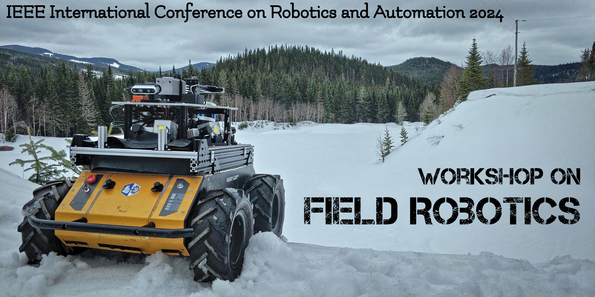

Field robotics tackles the problem of developing, deploying, and evaluating autonomous mobile systems in unstructured and often dynamic environments. Typical commercial applications are in agriculture, construction, mining, and forestry. The range of physical mediums is also very diversified: in the air, on the ground, underground, on the water, and underwater. These can be located on Earth, or on other celestial bodies (e.g., planets, moons, or asteroids). As such, field robotics works under wildly diverse and radically different assumptions than other areas of robotics, which tend to have well-defined working hypotheses. Therefore, this creates its own set of challenges. This workshop will thus offer the opportunity to present work and discuss how these unique challenges can be solved.

This workshop will bring together experts, researchers, and practitioners to discuss the latest advancements in field robotics. Participants will gain valuable insights into the challenges and opportunities that arise in deploying robots in diverse field scenarios, such as rugged terrains, remote locations, and hazardous environments. Practical case studies and real-world applications will be presented to showcase the successful, and not-so-successful cases of field robotics. The workshop will encourage fruitful dialogues and collaborative discussions, culminating by a panel at the end of the workshop. Attendees will leave with a comprehensive understanding of the state-of-the-art technologies, the main actors, and upcoming challenges. 

 

## Important dates

- Paper submission deadline: ???
- Notification of acceptance: ???
- Camera ready submission: ???
- Workshop date: ???

# Program   

| **Time***         | **Speaker**                                                              | **Topic/title**                                                                                               |
|-------------------|--------------------------------------------------------------------------|---------------------------------------------------------------------------------------------------------------|
| **9:00 - 9:15**   | Organizers                                                               | Welcome and opening remarks                                                                                   |
| **9:15 - 9:35**   | **Barry Lennox**  (University of Manchester)                         | Invited talk #1 - **Deployment of Robotic Systems for Decommissioning and Clean-up of Radioactive Facilities**    |
| **9:35 - 9:55**   | **Johannes Betz**  (Technical University of Munich)                  | Invited talk #2 - **Opportunities and Challenges with Autonomous Racing**                                         |
| **9:55 - 10:25**  | Ten emerging researchers                                                 | Spotlight talks #1 (3 min/pers)                                                                               |
| **10:25 - 11:10** | Coffee break and poster session                                          |                                                                                                               |
| **11:10 - 11:30** | TBD - Co-chair of IEEE TC for Agriculture Robotics                       | Invited talk #3 - **Field Report on Agriculture Robotics**                                                        |
| **11:30 - 11:50** | **Sebastian Scherer**  (Carnegie Mellon University)                  | Invited talk #4 - **Recent Progress on DARPA’s Robotic Autonomy in Complex Environments with Resiliency (RACER)** |
| **11:50 - 12:10** | TBD                                                                      |                                                                                                               |
| **12:10 - 13:30** | Lunch                                                                    |                                                                                                               |
| **13:30 - 14:30** | **Sanjiv Singh**  (Carnegie Mellon University)                       | Keynote - **Overview of the Last 20 Years in Field Robotics**                                                     |
| **14:30 - 15:00** | Ten emerging researchers                                                 | Spotlight talks #2 (3 min/pers)                                                                               |
| **15:00 - 15:45** | Coffee break and poster session                                          | Keynote - **Overview of the Last 20 Years in Field Robotics**                                                     |
| **15:45 - 16:05** | **Cédric Pradalier**  (Georgia Tech Lorraine)                        | Invited talk #6 - **Recent progress on ship inspections**                                                         |
| **16:05 - 16:25** | **Martin Saska**  (Czech Technical University in Prague)             | Invited talk #7 - **Results of the Mohamed Bin Zayed International Robotics Challenge (MBZIRC)**                  |
| **16:25 - 16:45** |  **Kostas Alexis**  (Norwegian University of Science and Technology) | Invited talk #8 - **Resilient Autonomy in Perceptually-degraded Environments: Experiences from the field**        |
| **16:45 - 17:05** | #todo                                                                    | Invited talk #9                                                                                               |
| **17:05 - 17:30** | Organizers                                                               | Panel discussion and conclusion                                                                               |

***Note**: All times are in the local time zone of ICRA 2024 (Yokohama).

# Speakers  

    

    
    

      

        <h3>Overview of the Last 20 Years in Field Robotics</h3>
        <strong>Sanjiv Singh</strong> 
        <em>Carnegie Mellon University</em> 
      

 

    

    
    

      

        <h3>Deployment of robotic systems for decommissioning and clean-up of radioactive facilities</h3>
        <strong>Barry Lennox</strong> 
        <em>University of Manchester</em> 
      

 

    

    
    

      

        <h3>Opportunities and Challenges with Autonomous Racing</h3>
        <strong>Johannes Betz</strong> 
        <em>Technical University of Munich</em> 
      

 

    

    
    

      

        <h3>Field Report on Agriculture Robotics</h3>
        <strong>TBD</strong> 
        <em>TBD</em> 
      

 

    

    
    

      

        <h3>Recent Progress on DARPA’s Robotic Autonomy in Complex Environments with Resiliency (RACER)</h3>
        <strong>Sebastian Scherer</strong> 
        <em>Carnegie Mellon University, Robotics Institute</em> 
      

 

    

    
    

      

        <h3>Recent Progress on Ship Inspections</h3>
        <strong>Cédric Pradalier</strong> 
        <em>Georgia Tech Lorraine</em> 
      

 

    

    
    

      

        <h3>Results of the Mohamed Bin Zayed International Robotics Challenge (MBZIRC)</h3>
        <strong>Martin Saska</strong> 
        <em>Czech Technical University in Prague</em> 
      

 

    

    
    

      

        <h3>Resilient Autonomy in Perceptually-degraded Environments: Experiences from the field</h3>
        <strong>Kostas Alexis</strong> 
        <em>Norwegian University of Science and Technology (NTNU)</em> 
      

 

# Call for papers

The workshop topics include, but not limited to:

- Agriculture
- Construction
- Forestry
- Healthcare
- Intelligent Transportation Systems
- Marine Robotics
- Mining
- Search and rescue
- Space exploration

## Submission guidelines

FR workshop accepts contributions based on the following criteria:

- The submission should be about 2 pages long (excluding references). The paper should follow the [IEEE RAS template](http://ras.papercept.net/conferences/support/tex.php).
- The review process is single-blind.
- We welcome perspective and conceptual papers as well.
- TODO: The papers should be submitted to this adress: ...
- Accepted papers will be available on the workshop website. The authors of accepted papers will be invited to present their results in a poster session during the workshop.
  

# Organizers

    

    
    

      

        <strong>François Pomerleau</strong> 
        <em>Université Laval</em> 
        <a href="https://norlab.ulaval.ca/people/f_pomerleau_fr/">Personnal website</a>
      

 

    

    
    

      

        <strong>Tim Barfoot</strong> 
        <em>University of Toronto</em>  
        <a href="http://asrl.utias.utoronto.ca/~tdb/">Personnal website</a>
      

 

    

    
    

      

        <strong>Marco Hutter</strong> 
        <em>ETH Zurich</em>  
        <a href="https://rsl.ethz.ch/the-lab/people/person-detail.MTIxOTEx.TGlzdC8yNDQxLC0xNDI1MTk1NzM1.html">Personnal website</a>
      

 

    

    
    

      

        <strong>Genya Ishigami</strong> 
        <em>Keio University</em>  
        <a href="https://www.st.keio.ac.jp/en/tprofile/mech/ishigami.html">Personnal website</a>
      

 

    

    
    

      

        <strong>Philippe Giguère</strong> 
        <em>Université Laval</em>  
        <a href="https://norlab.ulaval.ca/people/p_giguere_fr/">Personnal website</a>
      

 

    

    
    

      

        <strong>Johann Laconte</strong> 
        <em>French National Research Institute for Agriculture, Food and Environment (INRAE)</em>  
        <a href="https://johannlac.github.io/">Personnal website</a>
      

