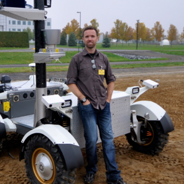
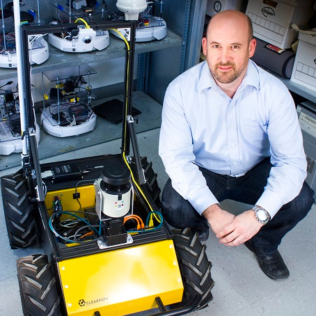

## Important dates

- Paper submission deadline: *TBD*, 2025, 11:59 p.m. (Anywhere on Earth)
- Notification of acceptance: *TBD*
- Camera-ready submission: *TBD*, 11:59 p.m. (Anywhere on Earth)
- Workshop date: *TBD*

# Context

Field robotics tackles the problem of developing, deploying, and evaluating autonomous mobile systems in unstructured and often dynamic environments. Typical commercial applications are in agriculture, construction, mining, and forestry. The range of physical mediums is also very diversified: in the air, on the ground, underground, on the water, and underwater. These can be located on Earth, or on other celestial bodies (e.g., planets, moons, or asteroids). As such, field robotics works under wildly diverse and radically different assumptions than other areas of robotics, which tend to have well-defined working hypotheses. Therefore, this creates its own set of challenges. This workshop will thus offer the opportunity to present work and discuss how these unique challenges can be solved.

This workshop will bring together experts, researchers, and practitioners to discuss the latest advancements in field robotics. Participants will gain valuable insights into the challenges and opportunities that arise in deploying robots in diverse field scenarios, such as rugged terrains, remote locations, and hazardous environments. Practical case studies and real-world applications will be presented to showcase the successful, and not-so-successful cases of field robotics. The workshop will encourage fruitful dialogues and collaborative discussions, culminating by a panel at the end of the workshop. Attendees will leave with a comprehensive understanding of the state-of-the-art technologies, the main actors, and upcoming challenges. As major outcomes, we aim to consolidate the community around field robotics and prepare an editorial article on the current status of robotics deployed in real environments.

 

# Program
All invited speakers are confirmed.

| **Time***         | **Speaker**                                                              | **Topic/title**                                                                                               |
|-------------------|--------------------------------------------------------------------------|-------------------------------------------------------------------------------------------------------------------|
| **9:00 - 9:15**   | Organizers                                                               | Welcome and opening remarks                                                                                       |
| **TBD**   | TBD                                                               | TBD                                                                                       |

***Note**: All times are in the local time zone of ICRA 2025 (Atlanta).

# Speakers  
<!-- copy paste this for each speaker-->

    

    
    

      

        <h3>Title of presentation</h3>
        <strong>Name</strong> 
        <em>Affiliation</em>   
        <a href="">Personal website</a>
      

 
<!-- end speaker1-->

# Call for papers

The workshop topics include, but are not limited to:

- Agriculture
- Construction
- Forestry
- Healthcare
- Intelligent Transportation Systems
- Marine Robotics
- Mining
- Search and rescue
- Space exploration

## Submission guidelines

FR workshop accepts contributions based on the following criteria:

- The submission should be from 2 to 8 pages long. The paper should follow the [IEEE RAS template](http://ras.papercept.net/conferences/support/tex.php).
- The review process is single-blind.
- Submissions should contain a clear focus on field robotics and feature lessons learned and/or field experience reports.
- We welcome prospective and conceptual papers as well.
- The papers should be submitted on Microsoft CMT: *TBD* 
- Accepted papers will be available on the workshop website. The authors of accepted papers will be invited to present their results in a poster session during the workshop.

# Organizers

    

    
    

      

        <strong>François Pomerleau</strong> 
        <em>Université Laval</em> 
        <a href="https://norlab.ulaval.ca/people/f_pomerleau/">Personal website</a>
      

 

    

    
    

      

        <strong>Tim Barfoot</strong> 
        <em>University of Toronto</em>  
        <a href="http://asrl.utias.utoronto.ca/~tdb/">Personal website</a>
      

 

    

    
    

      

        <strong>Keiji Nagatani</strong> 
        <em>University of Tokyo</em>  
        <a href="http://k-nagatani.org/">Personal website</a>
      

 

    

    
    

      

        <strong>Philippe Giguère</strong> 
        <em>Université Laval</em>  
        <a href="https://norlab.ulaval.ca/people/p_giguere_fr/">Personal website</a>
      

 

    

    
    

      

        <strong>Johann Laconte</strong> 
        <em>French National Research Institute for Agriculture, Food and Environment (INRAE)</em>  
        <a href="https://johannlac.github.io/">Personal website</a>
      

 

    

    
    

      

        <strong>Joshua Mangelson </strong> 
        <em>Brigham Young University</em>  
        <a href="https://ece.byu.edu/directory/josh-mangelson">Personal website</a>
      

