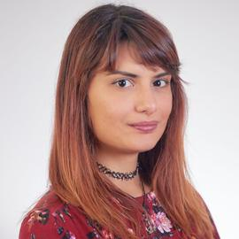
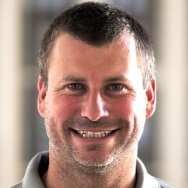
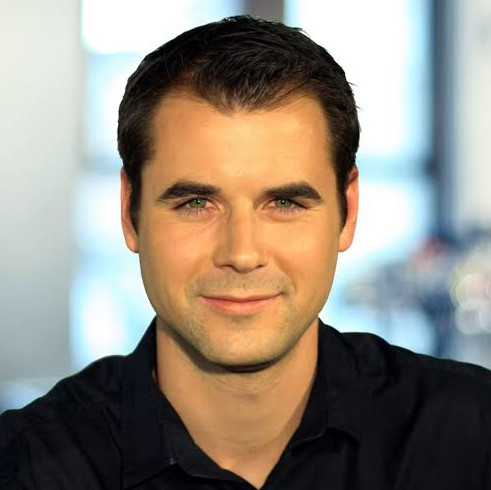
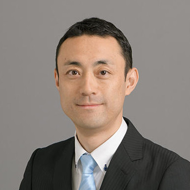

# Thanks!
The workshop on Field Robotics is over and was a tremendous success!
We received many contributions, out of which the accepted papers are listed in the following section, high quality talks, and had estimated the attendance to 250 researchers.
The workshop was the most crowded room of the day, demonstrating a clear need for field roboticists to gather and share experiences and lessons learned.

# Accepted papers

|                                                                                                                                                                                                                                                                                                                                           |
|:----------------------------------------------------------------------------------------------------------------------------------------------------------------------------------------------------------------------------------------------------------------------------------------------------------------------------------------------|
| **[3D Mapping of Glacier Moulins: Challenges and lessons learned](http://arxiv.org/abs/2404.18790)** William Dubois, Matěj Boxan, Johann Laconte, François Pomerleau                                                                                                                                                                       |
| **[A Sonar-based AUV Positioning System for Underwater Environments with Low Infrastructure Density](https://arxiv.org/abs/2405.01971)** Emilio Olivastri, Daniel Fusaro, Wanmeng Li, Simone Mosco, Alberto Pretto                                                                                                                         |
| **[A comparison between single-stage and two-stage 3D tracking algorithms for greenhouse robotics](https://arxiv.org/abs/2404.12963)** David Rapado-Rincon, Akshay K. Burusa, Eldert J. Henten, Gert Kootstra                                                                                                                              |
| **[A multi-robot system for the detection of explosive devices](https://arxiv.org/abs/2404.14167)** Ken Hasselmann, Mario Malizia, Rafael Caballero, Fabio Polisano, Shashank Govindaraj, Jakob Stigler, Oleksii Ilchenko, Milan Bajic, Geert De Cubber                                                                                    |
| **[Aquaculture field robotics: Applications, lessons learned and future prospects](https://arxiv.org/abs/2404.12995)** Herman Biorn Amundsen, Marios Xanthidis, Martin Fore, Sveinung Johan Ohrem, Eleni Kelasidi                                                                                                                          |
| **[Are We Ready for Planetary Exploration Robots? The TAIL-Plus Dataset for SLAM in Granular Environments](https://arxiv.org/abs/2404.13600)** Zirui Wang, Chen Yao, Yangtao Ge, Guowei Shi, Ningbo Yang, Zheng Zhu, Kewei Dong, Hexaing Wei, Zhenzhong Jia, Jing Wu                                                                       |
| **[AutoInspect: Towards Long-Term Autonomous Industrial Inspection](https://arxiv.org/abs/2404.12785)** Michal Staniaszek, Tobit Flatscher, Joseph Rowell, Hanlin Niu, Wenxing Liu, Yang You, Robert Skilton, Maurice Fallon, Nick Hawes                                                                                                   |
| **[Autonomous Active Mapping in Steep Alpine Environments with Fixed-wing Aerial Vehicles](https://arxiv.org/abs/2405.02011)** Jaeyoung Lim, Florian Achermann, Nicholas Lawrance, Roland Siegwart                                                                                                                                         |
| **[Autonomous Forest Inventory with Legged Robots: System Design and Field Deployment](https://arxiv.org/abs/2404.14157)** Matias Mattamala, Nived Chebrolu, Benoit Casseau, Leonard Freissmuth, Jonas Frey, Turcan Tuna, Marco Hutter, Maurice Fallon                                                                                     |
| **[Challenges and Opportunities for Large-Scale Exploration with Air-Ground Teams using Semantics](https://arxiv.org/abs/2405.07169)** Fernando Cladera, Ian D. Miller, Zachary Ravichandran, Varun Murali, Jason Hughes, M. Ani Hsieh, C. J. Taylor, Vijay Kumar                                                                          |
| **[Challenges in automatic and selective plant-clearing](https://arxiv.org/abs/2404.13996)** Fabrice Mayran Chamisso, Loïc Cotten, Valentine Dhers, Thomas Lompech, Florian Seywert, Arnaud Susset                                                                                                                                         |
| **[Comparing Motion Distortion Between Vehicle Field Deployments](http://arxiv.org/abs/2405.00189)** Nicolas Samson, Dominic Baril, Julien Lépine, François Pomerleau                                                                                                                                                                      |
| **[Development of Ultra-Portable 3D Mapping Systems for Emergency Services](https://arxiv.org/abs/2405.03514)** Charles Hamesse, Timothée Fréville, Juha Saarinen, Michiel Vlaminck, Hiep Luong, Rob Haelterman                                                                                                                            |
| **[Evaluating Collaborative Autonomy in Opposed Environments using Maritime Capture-the-Flag Competitions](https://arxiv.org/pdf/2404.17038)** Jordan Beason, Michael Novitzky, John Kliem, Tyler Errico, Zachary Serlin, Kevin Becker, Tyler Paine, Michael Benjamin, Prithviraj Dasgupta, Peter Crowley, Charles O'Donnell, John James   |
| **[Field Report on a Wearable and Versatile Solution for Field Acquisition and Exploration](http://arxiv.org/abs/2405.00199)** Olivier Gamache, Jean-Michel Fortin, Matěj Boxan, François Pomerleau, Philippe Giguère                                                                                                                      |
| **[FoMo: A Proposal for a Multi-Season Dataset for Robot Navigation in Forêt Montmorency](https://arxiv.org/abs/2404.13166)** Matěj Boxan, Alexander Krawciw, Effie Daum, Xinyuan Qiao, Sven Lilge, Timothy D. Barfoot, François Pomerleau                                                                                                 |
| **[From the Lab to the Theater: An Unconventional Field Robotics Journey](https://arxiv.org/abs/2404.07795)** Ali Imran, Vivek Shankar Varadharajan, Rafael Gomes Braga, Yann Bouteiller, Abdalwhab Bakheet Mohamed Abdalwhab, Matthis Di-Giacomo, Alexandra Mercader, Giovanni Beltrame, David St-Onge                                    |
| **[Lessons Learned in Quadruped Deployment in Livestock Farming](https://arxiv.org/abs/2404.16008)** Francisco J. Rodríguez-Lera, Miguel A. González-Santamarta, Jose Manuel Gonzalo Orden, Camino Fernández-Llamas, Vicente Matellán-Olivera, Lidia Sánchez-González                                                                      |
| **[Lessons from Deploying CropFollow++: Under-Canopy Agricultural Navigation with Keypoints](https://arxiv.org/pdf/2404.17718)** Arun N Sivakumar, Mateus V Gasparino, Michael McGuire, Vitor AH Higuti, M Ugur Akcal, Girish Chowdhary                                                                                                    |
| **[Maritime Vessel Tank Inspection using Aerial Robots: Experience from the field and dataset release](https://arxiv.org/abs/2404.19045)** Mihir Dharmadhikari, Nikhil Khedekar, Paolo De Petris, Mihir Kulkarni, Morten Nissov, Kostas Alexis                                                                                             |
| **[Mesh-based Photorealistic and Real-time 3D Mapping for Robust Visual Perception of Autonomous Underwater Vehicle](https://arxiv.org/abs/2404.18395)** Jungwoo Lee, Younggun Cho                                                                                                                                                         |
| **[Modular, Resilient, and Scalable System Design Approaches - Lessons learned in the years after DARPA Subterranean Challenge](https://arxiv.org/abs/2404.17759)** Prasanna Sriganesh, James Maier, Adam Johnson, Burhanuddin Shirose, Rohan Chandrasekar, Charles Noren, Joshua Spisak, Ryan Darnley, Bhaskar Vundurthy, Matthew Travers |
| **[Multi-modal Perception Dataset of In-water Objects for Autonomous Surface Vehicles](https://arxiv.org/abs/2404.18411)** Mingi Jeong, Arihant Chadda, Ziang Ren, Luyang Zhao, Haowen Liu, Monika Roznere, Aiwei Zhang, Yitao Jiang, Sabriel Achong, Samuel Lensgraf, Alberto Quattrini Li                                                |
| **[Multi-purpose robot for rehabilitation of small diameter water pipes](http://arxiv.org/abs/2405.14382)** J. Feiguel, M. Ndiaye, P. Chambaud, A. Chambellan, P. Blanc, S. Bourgeois, L. Labarussiat, C. Dubois, A. Vigneron, T. Desrez, A. Riwan, C. Vienne                                                                              |
| **[OtterROS: Picking and Programming an Uncrewed Surface Vessel for Experimental Field Robotics Research with ROS 2](https://arxiv.org/abs/2404.05627)** Sabrina R. Button Thomas M. C. Sears, Joshua A. Marshall                                                                                                                          |
| **[ReachBot Field Tests in a Mojave Desert Lava Tube as a Martian Analog](https://arxiv.org/abs/2405.15005)** Tony G Chen, Julia Di, Stephanie Newdick, Mathieu Lapotre, Marco Pavone, Mark Cutkosky                                                                                                                                       |
| **[Real-World Deployment of a Hierarchical Uncertainty-Aware Collaborative Multiagent Planning System](http://arxiv.org/abs/2404.17438)** Martina Stadler Kurtz, Samuel Prentice, Yasmin Veys, Long Quang, Carlos Nieto-Granda, Michael Novitzky, Ethan Stump, Nicholas Roy                                                                |
| **[RobotCycle: Assessing Cycling Safety in Urban Environments](https://arxiv.org/abs/2403.07789)** Efimia Panagiotaki, Tyler Reinmund, Stephan Mouton, Luke Pitt, Arundathi Shaji Shanthini, Wayne Tubby, Matthew Towlson, Samuel Sze, Brian Liu, Chris Prahacs, Daniele De Martini, Lars Kunze                                            |
| **[Robotic deployment on construction sites: considerations for safety and productivity impact](https://arxiv.org/abs/2404.13143)** Rafael Gomes Braga, Muhammad Owais Tahir, Ivanka Iordanova, David St-Onge                                                                                                                              |
| **[SVan: A Mobile Hub as a Field Robotics Development and Deployment Platform](https://arxiv.org/pdf/2405.03890)** Alexander Moortgat-Pick, Anna Adamczyk, Daniel A Duecker, Sami Haddadin                                                                                                                                                 |
| **[Situational Graphs for Robotic First Responders: an application to dismantling drug labs](https://arxiv.org/pdf/2404.17395)** W.J. Meijer, A.C. Kemmeren, J.M. Bruggen, T. Haije, J.E. Fransman, J.D. Mil                                                                                                                               |
| **[Survey on Datasets for Perception in Unstructured Outdoor Environments](https://arxiv.org/abs/2404.18750)** Peter Mortimer, Mirko Maehlisch                                                                                                                                                                                             |
| **[Toward Robust LiDAR based 3D Object Detection via Density-Aware Adaptive Thresholding](https://arxiv.org/abs/2404.13852)** Ayoung Kim Eunho Lee                                                                                                                                                                                         |
| **[Towards Long-term Robotics in the Wild](http://arxiv.org/abs/2404.18477)** Stephen Hausler, Ethan Griffiths, Milad Ramezani, Peyman Moghadam                                                                                                                                                                                            |
| **[Unified Map Handling for Robotic Systems: Enhancing Interoperability and Efficiency Across Diverse Environments](https://arxiv.org/abs/2404.13499)** James R. Heselden, Gautham P. Das                                                                                                                                                  |
| **[Watching Grass Grow: Long-term Visual Navigation and Mission Planning for Autonomous Biodiversity Monitoring](https://arxiv.org/pdf/2404.10446)** Matthew Gadd, Daniele De Martini, Luke Pitt, Wayne Tubby, Matthew Towlson, Chris Prahacs, Oliver Bartlett, Man Qi, Paul Newman, Andrew Hector, Roberto Salguero-Gomez, Nick Hawes     |

## Important dates

- Paper submission deadline: April 03, 2024, 11:59 p.m. (Anywhere on Earth)
- Notification of acceptance: *April 15, 2024*
- Camera-ready submission: *May 1, 2024, 11:59 p.m. (Anywhere on Earth)*
- Workshop date: *May 13, 2024*

# Program
All invited speakers are confirmed.

| **Time***         | **Speaker**                                                              | **Topic/title**                                                                                               |
|-------------------|--------------------------------------------------------------------------|-------------------------------------------------------------------------------------------------------------------|
| **9:00 - 9:15**   | Organizers                                                               | Welcome and opening remarks                                                                                       |
| **9:15 - 9:35**   | **Simon Watson**  (University of Manchester)                         | Invited talk #1 - **Deployment of Robotic Systems for Decommissioning and Clean-up of Radioactive Facilities**   |
| **9:35 - 9:55**   | **Johannes Betz**  (Technical University of Munich)                  | Invited talk #2 - **Opportunities and Challenges with Autonomous Racing**                                         |
| **9:55 - 10:25**  | Ten emerging researchers                                                 | Spotlight talks #1 (3 min/pers)                                                                                   |
| **10:25 - 11:10** | Coffee break and poster session                                          |                                                                                                                   |
| **11:10 - 11:30** | **Marija Popović**   (University of Bonn)                            | Invited talk #3 - **UAV Path Planning for Agricultural Applications**                                             |
| **11:30 - 11:50** | **Sebastian Scherer**  (Carnegie Mellon University)                  | Invited talk #4 - **Robust navigation in degraded environments in air and on land** |
| **11:50 - 12:10** | Organizers                                                               | Discussion on the [IEEE Transactions on Field Robotics (T-FR)](https://www.ieee-ras.org/publications/t-fr)         |
| **12:10 - 13:30** | Lunch                                                                    |                                                                                                                   |
| **13:30 - 14:30** | **Sanjiv Singh**  (Carnegie Mellon University)                       | Keynote - **Overview of the Last 20 Years in Field Robotics**                                                     |
| **14:30 - 15:00** | Ten emerging researchers                                                 | Spotlight talks #2 (3 min/pers)                                                                                   |
| **15:00 - 15:45** | Coffee break and poster session                                          |                                                                                                                   |
| **15:45 - 16:05** | **Yongliang Qiao**  (University of Adelaide)                         | Invited talk #6 - **Towards Unmanned Farm: Some Applications of Robotics in Modern Agriculture**                  |
| **16:05 - 16:25** | **Martin Saska**  (Czech Technical University in Prague)             | Invited talk #7 - **Towards agile aerial swarming in the wild**                  |
| **16:25 - 16:45** |  **Kostas Alexis**  (Norwegian University of Science and Technology) | Invited talk #8 - **Resilient Autonomy in Perceptually-degraded Environments: Experiences from the field**        |
| **16:45 - 17:05** | **Keiji Nagatani**  (The University of Tokyo)                        | Invited talk #9 - **Collaborative AI robots for adaptation of diverse environments and innovation of infrastructure construction**         |
| **17:05 - 17:30** | Organizers                                                               | Panel discussion and conclusion                                                                                   |

***Note**: All times are in the local time zone of ICRA 2024 (Yokohama).

# Speakers  

    

    
    

      

        <h3>Deployment of robotic systems for decommissioning and clean-up of radioactive facilities</h3>
        <strong>Simon Watson</strong> 
        <em>University of Manchester</em>   
        <a href="https://research.manchester.ac.uk/en/persons/simon.watson">Personal website</a>
      

 

    

    
    

      

        <h3>Opportunities and Challenges with Autonomous Racing</h3>
        <strong>Johannes Betz</strong> 
        <em>Technical University of Munich</em>   
        <a href="https://www.mos.ed.tum.de/en/avs/team/prof-dr-ing-johannes-betz/">Personal website</a>
      

 

    

    
    

      

        <h3>UAV Path Planning for Agricultural Applications</h3>
        <strong>Marija Mpopovic</strong> 
        <em>University of Bonn</em>   
        <a href="https://dmar-bonn.com/">Personal website</a>
      

 

    

    
    

      

        <h3>Robust navigation in degraded environments in air and on land</h3>
        <strong>Sebastian Scherer</strong> 
        <em>Carnegie Mellon University, Robotics Institute</em>   
        <a href="https://www.ri.cmu.edu/ri-faculty/sebastian-scherer/">Personal website</a>
      

 

    

    
    

      

        <h3>Overview of the Last 20 Years in Field Robotics</h3>
        <strong>Sanjiv Singh</strong> 
        <em>Carnegie Mellon University</em>   
        <a href="https://www.ri.cmu.edu/ri-faculty/sanjiv-singh/">Personal website</a>
      

 

    

    
    

      

        <h3>Towards Unmanned Farm: Some Applications of Robotics in Modern Agriculture</h3>
        <strong>Yongliang Qiao</strong> 
        <em>University of Adelaide</em>   
        <a href="https://researchers.adelaide.edu.au/profile/yongliang.qiao">Personal website</a>
      

 

    

    
    

      

        <h3>Towards agile aerial swarming in the wild</h3>
        <strong>Martin Saska</strong> 
        <em>Czech Technical University in Prague</em>   
        <a href="https://mrs.felk.cvut.cz/people/martin-saska">Personal website</a>
      

 

    

    
    

      

        <h3>Resilient Autonomy in Perceptually-degraded Environments: Experiences from the field</h3>
        <strong>Kostas Alexis</strong> 
        <em>Norwegian University of Science and Technology (NTNU)</em>   
        <a href="http://www.kostasalexis.com/">Personal website</a>
      

 

    

    
    

      

        <h3>Collaborative AI robots for adaptation of diverse environments and innovation of infrastructure construction</h3>
        <strong>Keiji Nagatani</strong> 
        <em>The University of Tokyo</em>  
        <a href="http://k-nagatani.org/">Personal website</a>
      

 

# Call for papers

The workshop topics include, but are not limited to:

- Agriculture
- Construction
- Forestry
- Healthcare
- Intelligent Transportation Systems
- Marine Robotics
- Mining
- Search and rescue
- Space exploration

## Submission guidelines

FR workshop accepts contributions based on the following criteria:

- The submission should be from 2 to 8 pages long. The paper should follow the [IEEE RAS template](http://ras.papercept.net/conferences/support/tex.php).
- The review process is single-blind.
- Submissions should contain a clear focus on field robotics and feature lessons learned and/or field experience reports.
- We welcome prospective and conceptual papers as well.
- The papers should be submitted on Microsoft CMT: [FRICRA2024](https://cmt3.research.microsoft.com/FRICRA2024/)
- Accepted papers will be available on the workshop website. The authors of accepted papers will be invited to present their results in a poster session during the workshop.

# Technical Committee endorsements
- [Agricultural Robotics and Automation (ARA)](https://www.ieee-ras.org/agricultural-robotics-automation)
- [Automation in Health Care Management (AHCM)](https://www.ieee-ras.org/automation-in-health-care-management)
- [Autonomous Ground Vehicles and Intelligent Transportation Systems (AGV-ITS)](https://www.ieee-ras.org/autonomous-ground-vehicles-and-intelligent-transportation-systems)
- [Energy, Environment, and Safety Issues in Robotics and Automation](https://www.ieee-ras.org/energy-environment-and-safety-issues-in-robotics-and-automation)
- [Marine Robotics (MR)](https://www.ieee-ras.org/marine-robotics)
- [Performance Evaluation and Benchmarking of Robotics and Autonomation Systems (PEBRAS)](https://www.ieee-ras.org/performance-evaluation)
- [Robotics and Automation in Nuclear Facilities (RANF)](https://www.ieee-ras.org/robotics-and-automation-in-nuclear-facilities)
- [Safety, Security, and Rescue Robotics (SSRR)](https://www.ieee-ras.org/safety-security-and-rescue-robotics)
- [Space Robotics (SR)](https://www.ieee-ras.org/space-robotics)

# Organizers

    

    
    

      

        <strong>François Pomerleau</strong> 
        <em>Université Laval</em> 
        <a href="https://norlab.ulaval.ca/people/f_pomerleau/">Personal website</a>
      

 

    

    
    

      

        <strong>Tim Barfoot</strong> 
        <em>University of Toronto</em>  
        <a href="http://asrl.utias.utoronto.ca/~tdb/">Personal website</a>
      

 

    

    
    

      

        <strong>Marco Hutter</strong> 
        <em>ETH Zurich</em>  
        <a href="https://rsl.ethz.ch/the-lab/people/person-detail.MTIxOTEx.TGlzdC8yNDQxLC0xNDI1MTk1NzM1.html">Personal website</a>
      

 

    

    
    

      

        <strong>Genya Ishigami</strong> 
        <em>Keio University</em>  
        <a href="https://www.st.keio.ac.jp/en/tprofile/mech/ishigami.html">Personal website</a>
      

 

    

    
    

      

        <strong>Philippe Giguère</strong> 
        <em>Université Laval</em>  
        <a href="https://norlab.ulaval.ca/people/p_giguere_fr/">Personal website</a>
      

 

    

    
    

      

        <strong>Johann Laconte</strong> 
        <em>French National Research Institute for Agriculture, Food and Environment (INRAE)</em>  
        <a href="https://johannlac.github.io/">Personal website</a>
      

 

# Context

Field robotics tackles the problem of developing, deploying, and evaluating autonomous mobile systems in unstructured and often dynamic environments. Typical commercial applications are in agriculture, construction, mining, and forestry. The range of physical mediums is also very diversified: in the air, on the ground, underground, on the water, and underwater. These can be located on Earth, or on other celestial bodies (e.g., planets, moons, or asteroids). As such, field robotics works under wildly diverse and radically different assumptions than other areas of robotics, which tend to have well-defined working hypotheses. Therefore, this creates its own set of challenges. This workshop will thus offer the opportunity to present work and discuss how these unique challenges can be solved.

This workshop will bring together experts, researchers, and practitioners to discuss the latest advancements in field robotics. Participants will gain valuable insights into the challenges and opportunities that arise in deploying robots in diverse field scenarios, such as rugged terrains, remote locations, and hazardous environments. Practical case studies and real-world applications will be presented to showcase the successful, and not-so-successful cases of field robotics. The workshop will encourage fruitful dialogues and collaborative discussions, culminating by a panel at the end of the workshop. Attendees will leave with a comprehensive understanding of the state-of-the-art technologies, the main actors, and upcoming challenges. As major outcomes, we aim to consolidate the community around field robotics and prepare an editorial article on the current status of robotics deployed in real environments.

 

