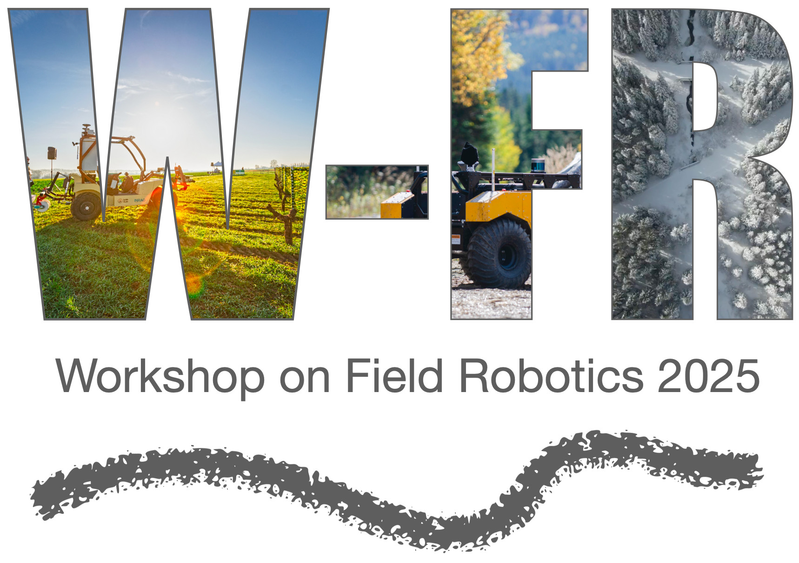
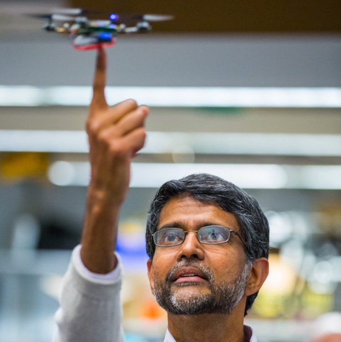
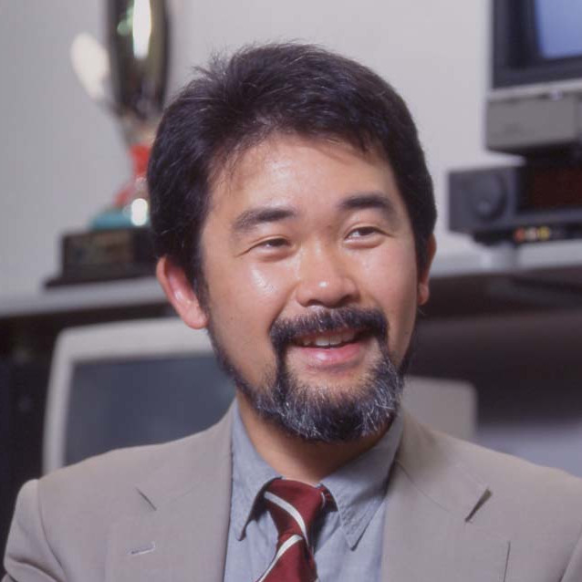
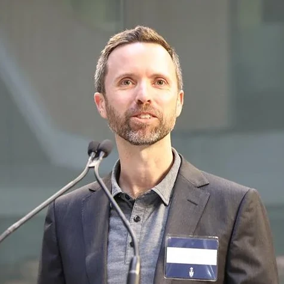

## Important dates

- Paper submission deadline: March 16, 2025, 11:59 p.m. (Anywhere on Earth)
- Notification of acceptance: April 15, 2025
- Camera-ready submission: May 1, 11:59 p.m. (Anywhere on Earth)
- Workshop date: May 19 or 23

# Context

Field robotics tackles the problem of developing, deploying, and evaluating autonomous mobile systems in unstructured and often dynamic environments. Typical commercial applications are in agriculture, construction, mining, and forestry. The range of physical mediums is also very diversified: in the air, on the ground, underground, on the water, and underwater. These can be located on Earth, or on other celestial bodies (e.g., planets, moons, or asteroids). As such, field robotics works under wildly diverse and radically different assumptions than other areas of robotics, which tend to have well-defined working hypotheses. Therefore, this creates its own set of challenges. This workshop will thus offer the opportunity to present work and discuss how these unique challenges can be solved.

This workshop will bring together experts, researchers, and practitioners to discuss the latest advancements in field robotics. Participants will gain valuable insights into the challenges and opportunities that arise in deploying robots in diverse field scenarios, such as rugged terrains, remote locations, and hazardous environments. Practical case studies and real-world applications will be presented to showcase the successful, and not-so-successful cases of field robotics. The workshop will encourage fruitful dialogues and collaborative discussions, culminating by a panel at the end of the workshop. Attendees will leave with a comprehensive understanding of the state-of-the-art technologies, the main actors, and upcoming challenges. As major outcomes, we aim to consolidate the community around field robotics and prepare an editorial article on the current status of robotics deployed in real environments.

 

# Preliminary Program
All invited speakers are confirmed.

| **Time**                | **Speaker**                                | **Topic/title**                                                                 |
|---------------------|----------------------------------------|------------------------------------------------------------------------------|
| 8:45- 9:00         | Organizers                             | Welcome and opening remarks                                                  |
| 9:00- 9:40         | **Robin Murphy** (Texas A&M University)     | Invited talk #1 - **30 Years of Robotics for Disasters”**                                                       |
| 9:40- 10:20        | Ten emerging researchers               | Spotlight talks #1 (3 min/pers)                                               |
| 10:20- 10:50       | -                                      | Coffee break and poster session                                               |
| 10:50- 11:10       | Organizers                             | Result announcement for the dataset competition                               |
| 11:10- 11:50       | **Marco Hutter** (ETH Zurich)              | Invited talk #2 - _Tentative title:_ **27 Years of Climbing and Walking Robots – Are We There?**                                                      |
| 11:50- 12:30       | Panel                                  | Questions: What is the role of simulation, and data sets in field robotics? Should we keep an annual workshop or create a separate conference? Why do old laboratories stop doing field deployments? |
| 12:30- 13:30       | -                                      | Lunch                                                                        |
| 13:30- 14:30       | **Vijay Kumar** (University of Pennsylvania) | Keynote - _Tentative title:_ **The Future of Flying Robots**                                                            |
| 14:30- 15:10       | **Frank Dellaert** (Georgia Institute of Technology) | Invited talk #3 - _Tentative title:_ **Can these farming robots save agriculture?**                                                    |
| 15:10- 15:55       | -                                      | Coffee break and poster session                                               |
| 15:55- 16:35       | **Stephan Williams** (The University of Sydney) | Invited talk #4 - _Tentative title:_ **Navigation, mapping, planning, and control applied to autonomous marine systems**                                                            |
| 16:35- 17:15       | **Kazuya Yoshida** (Tohoku University)     | Invited talk #5 - _Tentative title:_ **Modular and heterogeneous multi-agent AI robot system for lunar exploration**                                                       |
| 17:15- 17:45       | **Josh Marshall** (Queen’s University)     | Invited talk #6 - **Digging Deep: Robotics for Mining in the 21st Century**                                                       |
| 17:45- 18:00       | Organizers                             | Conclusion                                                                   |

***Note**: All times are in the local time zone of ICRA 2025 (Atlanta).

# Speakers  
<!-- copy paste this for each speaker

    

    
    

      

        <h3>Title of presentation</h3>
        <strong>Name</strong> 
        <em>Affiliation</em>   
        <a href="">Personal website</a>
      

 
end speaker1-->

    

    
    

      

        <h3>Tentative title: The Future of Flying Robots</h3>
        <strong>Vijay Kumar</strong> 
        <em>University of Pennsylvania</em>   
        <a href="https://www.kumarrobotics.org/">Personal website</a>
      

 

    

    
    

      

        <h3>Tentative title: Robots come to the rescue after a disaster</h3>
        <strong>Robin Murphy</strong> 
        <em>Texas A&M University</em>   
        <a href="https://engineering.tamu.edu/cse/profiles/rmurphy.html">Personal website</a>
      

 

    

    
    

      

        <h3>Tentative title: 27 Years of Climbing and Walking Robots – Are We There?</h3>
        <strong>Marco Hutter</strong> 
        <em>ETH Zurich</em>   
        <a href="https://rsl.ethz.ch/the-lab/people/person-detail.html?persid=121911">Personal website</a>
      

 

    

    
    

      

        <h3>Tentative title: Can these farming robots save agriculture?</h3>
        <strong>Frank Dellaert</strong> 
        <em>Georgia Institute of Technology</em>   
        <a href="https://dellaert.github.io/">Personal website</a>
      

 

    

    
    

      

        <h3>Tentative title: Navigation, mapping, planning, and control applied to autonomous marine systems</h3>
        <strong>Stephan Williams</strong> 
        <em>The University of Sydney</em>   
        <a href="https://www.sydney.edu.au/engineering/about/our-people/academic-staff/stefan-williams.html ">Personal website</a>
      

 

    

    
    

      

        <h3>Tentative title: Modular and heterogeneous multi-agent AI robot system for lunar exploration</h3>
        <strong>Kazuya Yoshida</strong> 
        <em>Tohoku University</em>   
        <a href="http://www.astro.mech.tohoku.ac.jp/e/">Personal website</a>
      

 

    

    
    

      

        <h3>Tentative title: Robotics, Automation, and the 21st Century Miner</h3>
        <strong>Josh Marshall</strong> 
        <em>Queen’s University</em>   
        <a href="https://www.queensu.ca/offroad-robotics/people/joshua-marshall ">Personal website</a>
      

 

# Call for papers

The workshop topics include, but are not limited to:

- Agriculture
- Construction
- Forestry
- Healthcare
- Intelligent Transportation Systems
- Marine Robotics
- Mining
- Search and rescue
- Space exploration

## Submission guidelines

FR workshop accepts contributions based on the following criteria:

- The submission should be from 2 to 8 pages long. The paper should follow the [IEEE RAS template](http://ras.papercept.net/conferences/support/tex.php).
- The review process is single-blind.
- Submissions should contain a clear focus on field robotics and feature lessons learned and/or field experience reports.
- We welcome prospective and conceptual papers as well.
- The papers should be submitted on [Microsoft CMT](https://cmt3.research.microsoft.com/FRICRA2025).
- Accepted papers will be available on the workshop website. The authors of accepted papers will be invited to present their results in a poster session during the workshop.

# Competition

This year, the field robotics workshop features multiple competition tracks designed to address key challenges in field robot deployment.
The competition focuses on vision-based tasks such as 2D and 3D Semantic Segmentation and SLAM in challenging environments like dense vegetation. 
Participants have access to extensive datasets, including recordings from wheeled, tracked, and multi-legged robots navigating challenging off-road terrains from the [GOOSE](https://goose-dataset.de/) and [GOOSE-Ex](https://arxiv.org/pdf/2409.18788) dataset. 
The SLAM dataset features radar-based perception data for off-road environments and multispectral data for scenarios where passive sensors are crucial. 

The top-performing teams are invited to present their results during the workshop poster sessions and receive prizes.
The competitions are open to all field robotics researchers and practitioners.

Please visit the competition websites for more details:

**Vision Tracks:**
 - [GOOSE + GOOSE-Ex: 2D Semantic Segmentation Challenge](#) (start date: February 7, 2025)
 - [GOOSE + GOOSE-Ex: 3D Semantic Segmentation Challenge](#) (start date: February 7, 2025)

**SLAM Tracks:**
 - coming soon...

Any questions about the competition can be directed at [field-robotics-competition-icra-25@googlegroups.com](mailto:field-robotics-competition-icra-25@googlegroups.com?subject=Question%20regarding%20the%20Field%20Robotics%20Dataset%20Competitions).

# Organizers

    

    
    

      

        <strong>François Pomerleau</strong> 
        <em>Université Laval</em> 
        <a href="https://norlab.ulaval.ca/people/f_pomerleau/">Personal website</a>
      

 

    

    
    

      

        <strong>Tim Barfoot</strong> 
        <em>University of Toronto</em>  
        <a href="http://asrl.utias.utoronto.ca/~tdb/">Personal website</a>
      

 

    

    
    

      

        <strong>Keiji Nagatani</strong> 
        <em>University of Tokyo</em>  
        <a href="http://k-nagatani.org/">Personal website</a>
      

 

    

    
    

      

        <strong>Philippe Giguère</strong> 
        <em>Université Laval</em>  
        <a href="https://norlab.ulaval.ca/people/p_giguere_fr/">Personal website</a>
      

 

    

    
    

      

        <strong>Johann Laconte</strong> 
        <em>French National Research Institute for Agriculture, Food and Environment (INRAE)</em>  
        <a href="http://rleaf.mathnum.inrae.fr/people/jlaconte/">Personal website</a>
      

 

    

    
    

      

        <strong>Joshua Mangelson </strong> 
        <em>Brigham Young University</em>  
        <a href="https://ece.byu.edu/directory/josh-mangelson">Personal website</a>
      

 

    

    
    

      

        <strong>Sven Lilge </strong> 
        <em>University of Toronto</em>  
        <a href="https://svenlilge.github.io/">Personal website</a>
      

 

## Competition Organizers

  <table style="margin: 0 auto; border-collapse: collapse; border: none; cellpadding: 0; cellspacing: 0;">
    <tr>
      <td style="width: 80px; vertical-align: top; height: 120px; border: none;">
         <strong>Jan Faigl</strong>
      </td>
      <td style="width: 80px; vertical-align: top; height: 120px; border: none;">
         <strong>Gerald Steinbauer-Wagner</strong>
      </td>
      <td style="width: 80px; vertical-align: top; height: 120px; border: none;">
         <strong>Miloš Prágr</strong>
      </td>
      <td style="width: 80px; vertical-align: top; height: 120px; border: none;">
         <strong>Raphael Hagmanns</strong>
      </td>
    </tr>
    <tr>
      <td style="width: 80px; vertical-align: top; height: 120px; border: none;">
         <strong>Miguel Granero</strong>
      </td>
      <td style="width: 80px; vertical-align: top; height: 120px; border: none;">
         <strong>Vladimír Kubelka</strong>
      </td>
      <td style="width: 80px; vertical-align: top; height: 120px; border: none;">
         <strong>Peter Mortimer</strong>
      </td>
    </tr>
  </table>

